<div align="center">

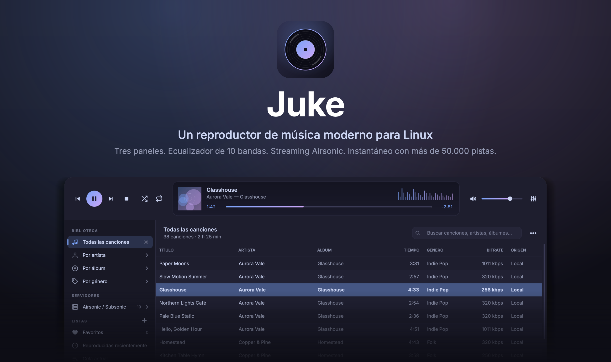

<br>

**Un reproductor de música moderno de 3 paneles para Linux.**<br>
Tus archivos, tu servidor Airsonic / Subsonic, radio por Internet y un ecualizador de 10 bandas. Se mantiene rápido con bibliotecas grandes y gasta poca batería.

<br>

[English](README.md) · **Español**

<br>


[**Descargar**](https://github.com/vezzulab/juke/releases/latest) &nbsp;·&nbsp; [**Sitio web**](https://vezzulab.github.io/juke/) &nbsp;·&nbsp; [Reportar un problema](https://github.com/vezzulab/juke/issues)

</div>

<br>

## Por qué Juke

Un diseño clásico de tres paneles — fuentes a la izquierda, canciones en el centro, el reproductor arriba — reconstruido para hoy: una interfaz oscura *o* clara, redondeada y con aire Libadwaita, una tubería de audio de verdad y una biblioteca que no se traba cuando crece.

<table>
<tr>
<td width="50%" valign="top">

### Instantáneo, sin importar el tamaño
La tabla de canciones nunca carga tu biblioteca en memoria. Guarda una lista ordenada de ids y trae las filas de SQLite página a página mientras haces scroll. Buscar, ordenar y filtrar ocurre en la base de datos, sobre columnas indexadas.

</td>
<td width="50%" valign="top">

### Airsonic, como lo tienes organizado
Recorre tu servidor **por carpetas**, tal como las muestra, o por artista / álbum / género. La sincronización usa la búsqueda masiva del servidor — una biblioteca de 6.000 canciones en unos 8 segundos —, reintenta las peticiones lentas y nunca borra canciones que no pudo alcanzar. Las canciones se reproducen en streaming directo; no se descarga nada antes.

</td>
</tr>
<tr>
<td valign="top">

### Radio por Internet
**Mis Emisoras**, **Explorar Radio** (el directorio comunitario radio-browser.info) y **Añadir emisora por URL**: pega una página web, una transmisión o una lista `.pls` / `.m3u` y Juke encuentra el audio. El LCD muestra **EN VIVO**, la emisora y la canción que suena. Las emisoras cambian su dirección de transmisión todo el tiempo, así que Juke las sigue cuando se mueven.

</td>
<td valign="top">

### Ligero con los recursos
Un Juke inactivo **no genera ningún despertar**. Reproduciendo con batería usa alrededor del **1 %** de un núcleo. libVLC, la red y el lector de etiquetas se cargan solo cuando hacen falta, y el medidor de niveles se queda quieto con batería. Cifras medidas más abajo.

</td>
</tr>
<tr>
<td valign="top">

### Ecualizador de 10 bandas
Diez bandas (60 Hz – 16 kHz), preamp de ±20 dB, diez presets incluidos y los tuyos. Usa el ecualizador nativo de libVLC sobre un único reproductor de larga vida, así que cambiar de canción — o sintonizar una emisora — nunca lo reinicia.

</td>
<td valign="top">

### Una cola de verdad, y tus propias listas
**Reproducir a continuación** inserta justo después de la canción actual; **Añadir a la cola** va al final. La cola es temporal e independiente de la lista desde la que empezaste, que continúa cuando la cola se vacía. Crea listas con el **+** junto a *Listas*.

</td>
</tr>
<tr>
<td valign="top">

### Oscuro y claro
Elige un tema, o deja que Juke siga a tu escritorio. Las dos paletas están comprobadas para que se lean bien (contraste WCAG) y el cambio es instantáneo — `Ctrl` + `T`.

</td>
<td valign="top">

### Actualizaciones a tu manera
Al abrirse, y cada 30 minutos mientras está abierto (desactivable), Juke pregunta a GitHub si hay una versión más reciente. Si la hay, muestra qué cambió y **tú** eliges *Actualizar ahora*, *Más tarde* u *Omitir esta versión*. Las descargas se verifican con su SHA-256 antes de reemplazar nada.

</td>
</tr>
<tr>
<td valign="top">

### Local y remoto, una sola biblioteca
Los archivos del disco y las canciones de tu servidor comparten el mismo modelo de metadatos. Juke solo pide la URL reproducible — `file:///…` o `https://…/stream.view` — en el momento en que pulsas Play.

</td>
<td valign="top">

### Bilingüe y listo para Wayland
Inglés y español, con cambio en vivo. Escalado HiDPI de Qt 6 (también fraccionario), Wayland primero con X11 como respaldo, y todos los iconos son SVG dibujados a la escala exacta de tu pantalla: nada borroso.

</td>
</tr>
</table>

## Tu música, en tus carpetas

Bajo **Carpetas** en el panel lateral, Juke guarda tu música como tú la organizas. No hay paso de importar: lo que hagas simplemente pasa.

- **Music.juke** está en tu carpeta Música como una biblioteca. Al abrirla encuentras `folders.db` (cómo está organizado todo), una carpeta `Folders` con el mismo árbol como accesos directos a tus canciones, y un README corto. Tus archivos se quedan donde están: Juke nunca los mueve, renombra ni borra.
- Crea carpetas, mete carpetas dentro de carpetas, arrastra canciones desde la lista, o suelta archivos y carpetas enteras desde tu explorador de archivos sobre el panel lateral. Las carpetas soltadas conservan su estructura.
- Clic derecho en una carpeta para renombrarla, duplicarla o borrarla, ordenar lo que tiene dentro (A→Z, Z→A, por número, más nuevo, más antiguo), reproducirla, mezclarla o añadirla a la cola.
- Borrar una carpeta saca sus canciones de Juke; los archivos siguen en el disco. Si borras o mueves una carpeta desde el explorador, Juke lo nota en cuanto vuelves a él.
- **Buscar duplicados** está en el menú ⋯, junto a *Mostrar* para Favoritos, Reproducidas recientemente y la cola.
- **Editar metadatos** sirve para una canción o para muchas. Selecciona con `Ctrl` + `A`, `Ctrl` + clic o `Mayús` + clic, clic derecho ▸ *Editar metadatos…*, y solo se escriben los campos que cambies. Añade, cambia o quita la carátula, o suelta una imagen sobre la ventana; se guarda en el propio archivo.
- La ventana de actualización dice en qué versión estás, cuál salió y qué cambió, y aceptas o cancelas.
- **Enviar comentarios…** y **Ver registro…** están en el menú ⋯. El reporte se abre como un problema nuevo en GitHub para que lo revises. Antes se ocultan tu carpeta personal, contraseñas y la dirección de tu servidor.
- El AppImage se añade solo a tu menú de aplicaciones la primera vez que se ejecuta.
- **Veinte temas de color**, diez claros y diez oscuros, a un clic del botón de paleta junto al menú ⋯. Pasteles suaves (Rosa, Lavanda, Menta, Cielo, Durazno, Arena, Laguna, Coral, Salvia, Limón) y looks más profundos (Bosque profundo, Océano, Atardecer, Neón, Brasa, Ártico, Crepúsculo, Ámbar, Palorrosa, Grafito), todos comprobados para leerse bien.
- **Letras.** Clic derecho en una canción ▸ *Añadir letra…* (pégala o importa un archivo `.lrc`) o *Buscar letra…*, que busca en [LRCLIB](https://lrclib.net), un servicio gratuito de letras, por el nombre de la canción. Una columna a la derecha se abre sola cuando la canción que suena tiene letra, y se queda cerrada cuando no la tiene. Las letras sincronizadas iluminan la línea que va sonando. Juke también lee un archivo `.lrc` junto a la canción y la letra que venga en sus etiquetas.

## Capturas

<div align="center">
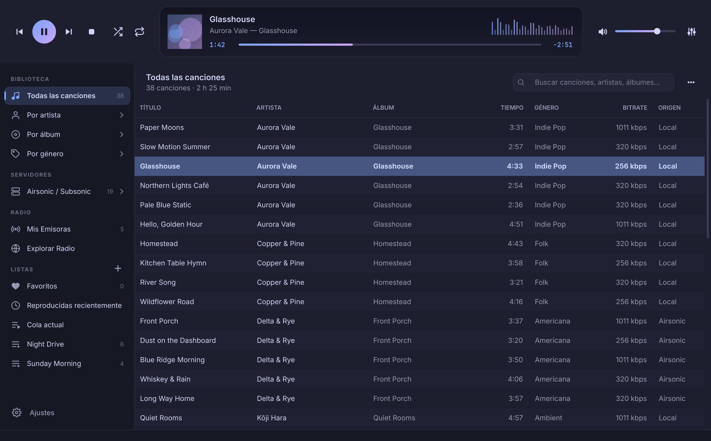
</div>

<table>
<tr>
<td width="50%">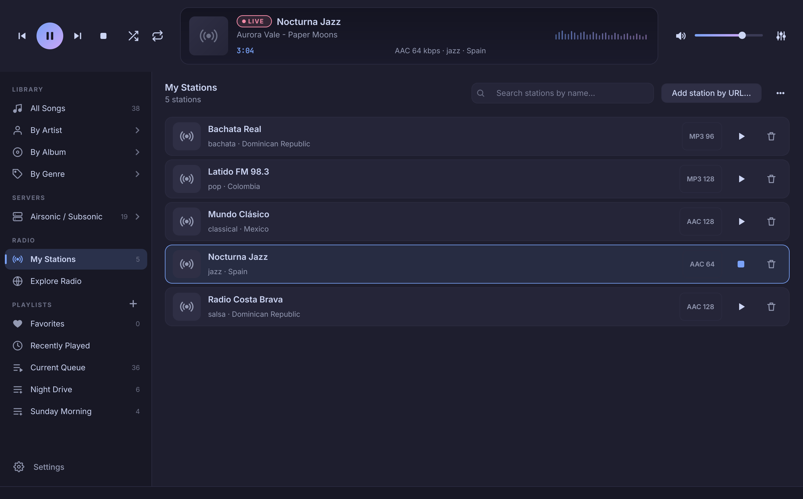<br><sub><b>Radio por Internet</b> — emisoras guardadas, la insignia <b>LIVE</b> y la canción que suena.</sub></td>
<td width="50%">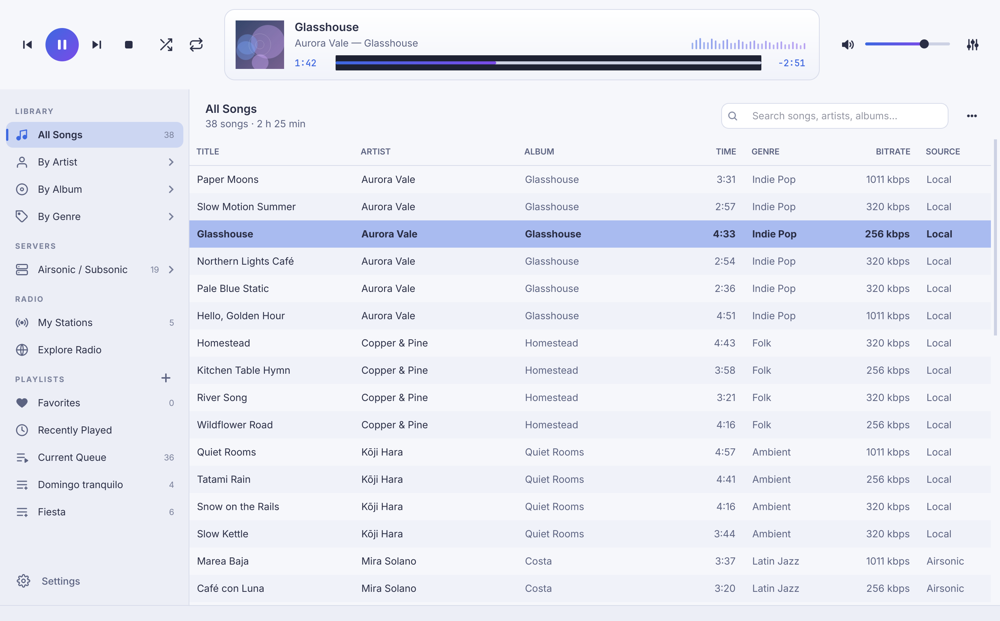<br><sub><b>Tema claro</b> — o sigue a tu escritorio automáticamente.</sub></td>
</tr>
<tr>
<td>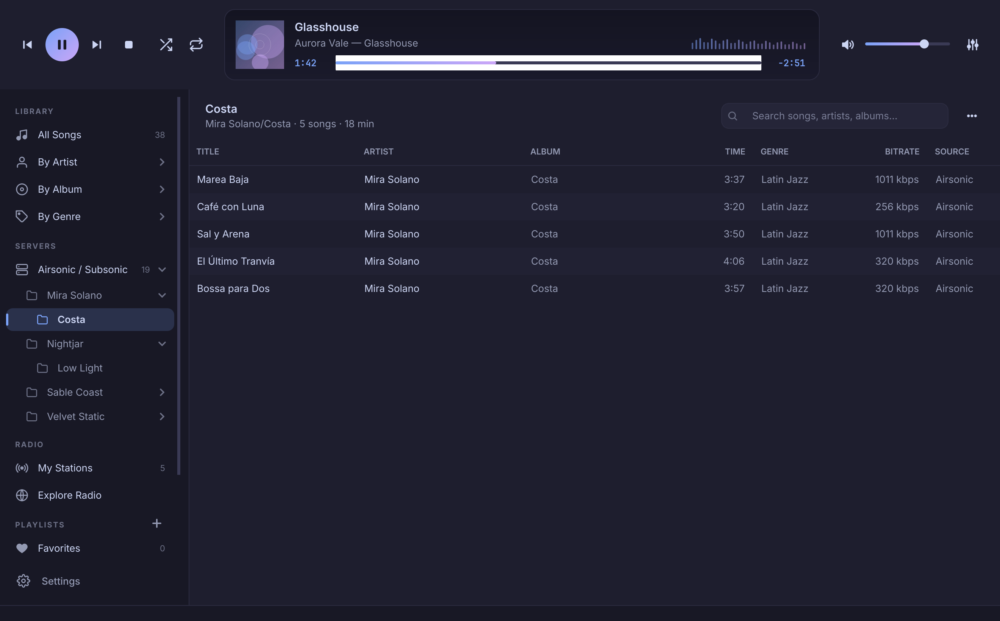<br><sub><b>Airsonic por carpetas</b> — la jerarquía del servidor, desplegable en el panel lateral.</sub></td>
<td>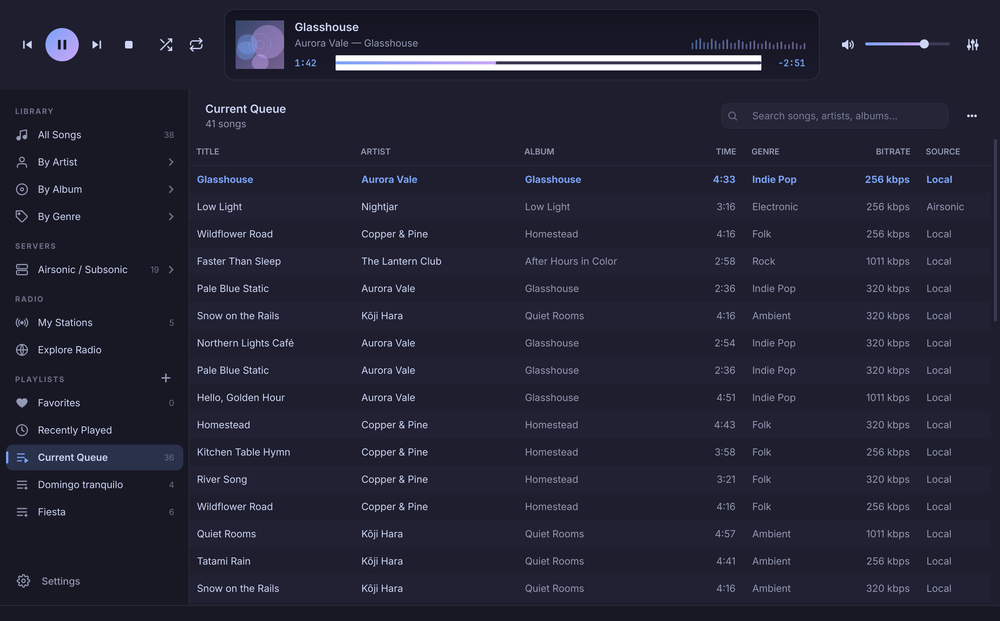<br><sub><b>Cola actual</b> — a continuación, añadidas a la cola y luego la lista de origen.</sub></td>
</tr>
<tr>
<td>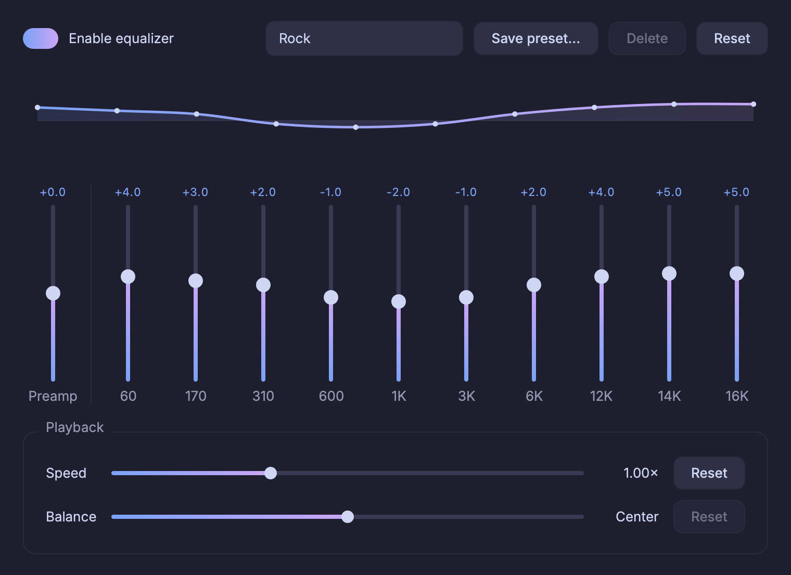<br><sub><b>Ecualizador</b> — curva de respuesta en vivo, presets, velocidad y balance estéreo.</sub></td>
<td>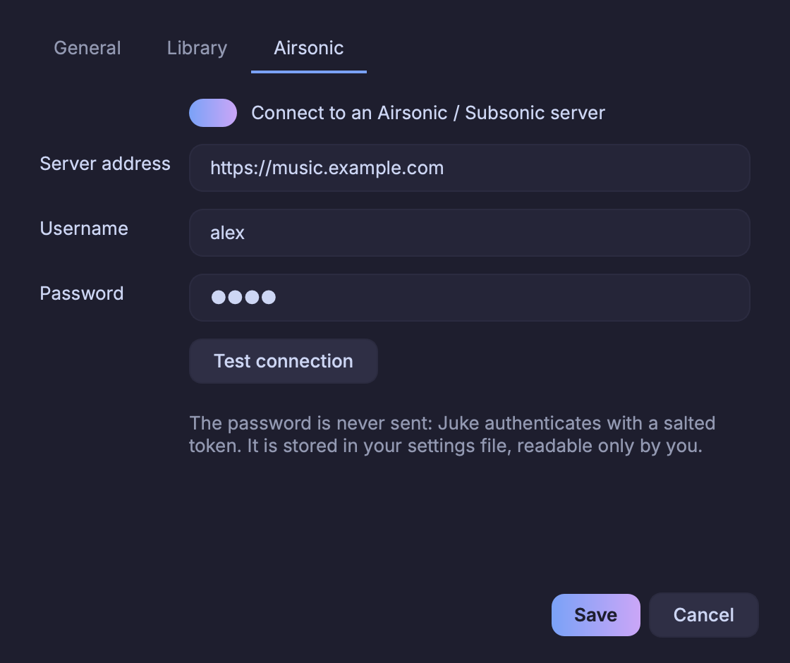<br><sub><b>Ajustes</b> — idioma, tema, carpetas, actualizaciones y tu servidor Airsonic / Subsonic.</sub></td>
</tr>
</table>

> Salvo la principal, las capturas están en inglés; toda la interfaz cambia de idioma en vivo desde *Ajustes*.

## Juke para Android

<div align="center">
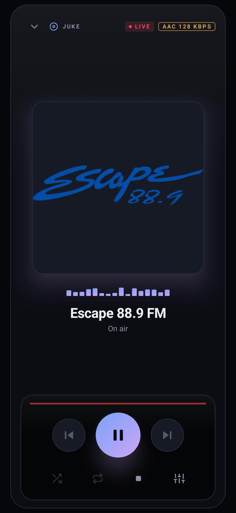
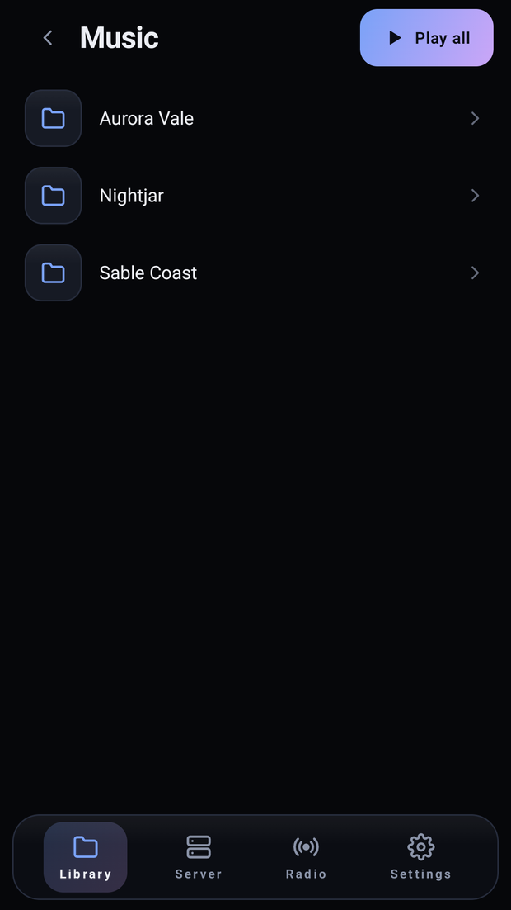
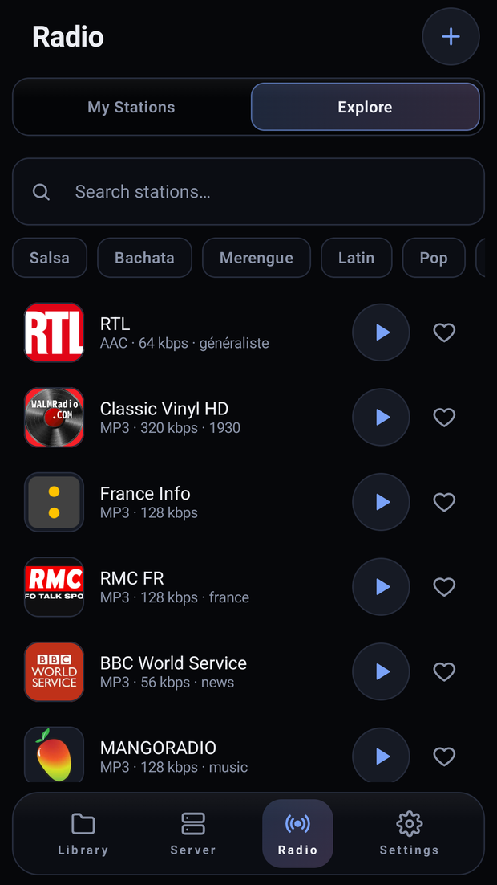
</div>

Juke también funciona en un teléfono o una tableta. Está en [`android/`](android), escrito en Kotlin
con Jetpack Compose y Media3.

- Tu música de la tarjeta o del almacenamiento del teléfono, por carpetas. Hay teléfonos sin tarjeta,
  y entonces muestra el almacenamiento interno.
- Tu servidor Airsonic / Subsonic en su propia pestaña, también por carpetas.
- Radio: el directorio, o pega una dirección. Si una página tiene varias emisoras, te las ofrece todas.
- Sigue sonando con la pantalla apagada, con los controles de siempre en la notificación.
- *Ajustes ▸ Ayuda* tiene **Enviar comentarios** y el **registro** de la app, con los datos privados ocultos, y un botón para **apoyar en Ko-fi**.
- Los mismos veinte temas de color, en *Ajustes ▸ Colores*.
- **Letras y karaoke.** Busca la letra por el nombre de la canción o pégala, míralas seguir a la canción, y pasa a **Karaoke**: líneas grandes, cuenta regresiva antes de cada frase y **Reducir voz**, que quita al cantante principal de la canción.
- **Ordena** carpetas y canciones de A → Z o de Z → A, en la biblioteca y en el servidor.
- Mejor en la pantalla de bloqueo: la tarjeta del reproductor, la notificación y los botones de audífonos o Bluetooth funcionan, tocar la notificación abre Juke, y el sistema puede reanudar lo que sonaba. La barra de tiempo sigue tu dedo y muestra al instante a dónde saltas.
- Ecualizador de 10 bandas, español e inglés, oscuro y claro.

Descarga `Juke-<versión>.apk` de la [última versión](https://github.com/vezzulab/juke/releases/latest).
Necesita Android 8 o superior y pesa unos 3 MB. Para construirlo hacen falta el SDK de Android y JDK 17:

```sh
cd android
./gradlew :app:assembleDebug
```

## Instalación

### AppImage (recomendado)

1. Descarga `Juke-x86_64.AppImage` (unos 190 MB) de la [última versión](https://github.com/vezzulab/juke/releases/latest).
2. Hazlo ejecutable y ábrelo:

   ```sh
   chmod +x Juke-x86_64.AppImage
   ./Juke-x86_64.AppImage
   ```

3. Eso es todo. La primera vez que se ejecuta, Juke se añade a tu **menú de aplicaciones con su icono**. Solo toca tu propia cuenta de usuario (`~/.local/share/applications` y `~/.local/share/icons`) y puedes deshacerlo cuando quieras en *Ajustes*.

O en una sola línea, que lo descarga, lo hace ejecutable y lo abre:

```sh
curl -fsSL https://vezzulab.github.io/juke/install.sh | sh
```

Todo lo que Juke necesita — Python, Qt, libVLC y yt-dlp — va dentro del archivo; no hay nada más que instalar. Espera:

- Linux x86_64 con **glibc 2.35 o superior** (Ubuntu 22.04, Debian 12, Fedora 36 o más reciente)
- PulseAudio o PipeWire para el sonido (presentes en prácticamente todo escritorio)
- FUSE 2 (`libfuse2`) — o ejecútalo con `--appimage-extract-and-run`

**Actualizar:** Juke te avisa cuando sale una versión nueva (o usa *menú ▸ Buscar actualizaciones…*). Si el AppImage está en una carpeta donde puedes escribir, *Actualizar ahora* lo reemplaza en su sitio y ofrece reiniciar.

### Desde el código fuente

Juke necesita libVLC instalado en el sistema:

| Distribución | libVLC |
| --- | --- |
| Fedora | `sudo dnf install vlc-libs` (RPM Fusion) |
| Debian / Ubuntu | `sudo apt install libvlc5 vlc-plugin-base` |
| Arch | `sudo pacman -S vlc` |

```sh
git clone https://github.com/vezzulab/juke.git
cd juke
python -m venv .venv && . .venv/bin/activate
pip install -e .
juke                 # o: python -m juke
```

Para añadir al menú el lanzador y el icono de una instalación desde fuente: `juke --install-desktop` (y `--uninstall-desktop` para quitarlo). Los archivos pasados por la línea de comandos se reproducen: `juke cancion.flac`.

## Uso

| | |
| --- | --- |
| **Biblioteca** | Añade tus carpetas de música en *Ajustes ▸ Biblioteca* (o con el botón de la biblioteca vacía). Juke las indexa en un hilo de baja prioridad y solo relee los archivos que cambiaron. |
| **Airsonic** | Abre **Ajustes** desde el menú ⋯ (o *Configurar Airsonic…* en la vista vacía de Airsonic) ▸ pestaña *Airsonic*: dirección del servidor (p. ej. `http://tu-servidor:4040`), usuario y contraseña, luego *Probar conexión*. *Sincronizar Airsonic* importa el servidor; recórrelo en **Servidores**. Las canciones terminadas se registran (scrobble) en el servidor. Se admiten servidores que no pueden comprobar tokens con sal (Airsonic-Advanced con contraseñas con hash): Juke entra entonces con la contraseña y te recomienda usar `https://`. |
| **Radio** | En **Radio**: *Mis Emisoras* (las tuyas) y *Explorar Radio* (busca por nombre o elige una etiqueta). ♥ guarda una emisora, ▶ la sintoniza. *Añadir emisora por URL…* acepta cualquier dirección web. Detalles abajo. |
| **Cola** | Clic derecho ▸ **Reproducir a continuación** / **Añadir a la cola**. ⋯ ▸ *Mostrar* ▸ *Cola actual* lista lo que suena, lo que encolaste y lo que sigue. |
| **Listas** | Pulsa el **+** junto a *Listas* (o `Ctrl` + `N`). Clic derecho en canciones ▸ *Añadir a la lista*; clic derecho en una lista para renombrarla o eliminarla. Las listas sobreviven a los reescaneos y a las resincronizaciones de Airsonic. |
| **Favoritos** | Clic derecho ▸ *Marcar como favorita*. Se ven desde ⋯ ▸ *Mostrar*. |
| **Carpetas** | Pulsa el **+** junto a *Carpetas*, o arrastra canciones y carpetas. Clic derecho en una carpeta para el resto. |
| **Etiquetas y carátula** | Clic derecho ▸ *Editar metadatos…* escribe en los archivos (canciones locales), una o varias a la vez, carátula incluida. |
| **Tema** | *Ajustes ▸ Tema* (igual que el sistema / oscuro / claro) o `Ctrl` + `T`. |

| Atajo | Acción |
| --- | --- |
| `Espacio` | Reproducir / pausar |
| `Enter` o doble clic | Reproducir la canción seleccionada |
| `Ctrl` + `→` / `←` | Siguiente / anterior |
| `Ctrl` + `F` | Buscar |
| `Ctrl` + `N` | Nueva lista |
| `Ctrl` + `E` | Ecualizador |
| `Ctrl` + `T` | Cambiar claro / oscuro |
| `Ctrl` + `,` | Ajustes |
| `Ctrl` + `Q` | Salir |

### Añadir una emisora por URL

Pega una dirección y Juke muestra *Buscando señal de audio…* mientras averigua dónde está el audio:

1. **Directa:** la dirección es una transmisión (`.mp3`, `.aac`, `.ogg`, `.m3u8`), un punto de montaje Icecast / Shoutcast (`http://host:8000/stream`) o una lista `.pls` / `.m3u` — se usa la primera entrada que funcione. A las direcciones sin pista se les pregunta qué son.
2. **Páginas web:** primero se prueban las direcciones de transmisión que enlaza la página (el reproductor de una emisora suele incrustar `…:8146/stream`, un `.m3u8`, un `.pls` o una etiqueta `<audio>`) y después [yt-dlp](https://github.com/yt-dlp/yt-dlp). Lo que termina — un vídeo de introducción, una cuña — no es una emisora y solo se usa si no aparece nada en vivo.
3. **Nombre e icono:** de la cabecera ICY de la transmisión o del título de la página, y el icono de la página.

Los sitios de noticias y blogs suelen solo *nombrar* a sus emisoras; si una página no tiene audio, Juke lo dice y te lleva a *Explorar Radio*.

**Las emisoras se mueven.** Cambian su dirección de transmisión todo el tiempo, así que una emisora guardada recuerda de dónde salió: su id de Radio-Browser, o la página o lista que diste. Al sintonizarla, Juke reproduce la dirección guardada al instante y comprueba en segundo plano; si la emisora se movió, o la transmisión se cae, cambia a la dirección nueva y la recuerda.

**La canción en el aire.** El LCD muestra el título ICY que envía la emisora. libVLC no pide títulos en transmisiones `https://`, así que Juke los lee por su cuenta: una petición pequeña al sintonizar y cada 30 segundos después, solo mientras la ventana está a la vista. Se ignoran textos de relleno como "Now Playing info goes here".

## Privacidad

Juke no tiene telemetría, ni cuentas, ni analítica. Lleva incluidas su tipografía y sus iconos, así que no hace peticiones para ellos. Se conecta a:

| Qué | Cuándo |
| --- | --- |
| Tu servidor Airsonic / Subsonic | Solo si configuras uno. |
| `api.github.com` | Al abrirse y cada 30 minutos mientras está abierto, para buscar una versión nueva, si dejas activada *Buscar actualizaciones automáticamente*. Solo se envían el nombre y la versión del programa. |
| Radio Browser (`*.api.radio-browser.info`) y las propias emisoras | Solo cuando abres *Explorar Radio*, añades una emisora o la sintonizas. |
| `lrclib.net` | Solo cuando pulsas *Buscar letra…*, o si activas *Buscar letras en línea* en Ajustes. Recibe el nombre, el artista, el álbum y la duración de la canción, nada más. |
| `github.com` (la página de problemas) | Solo cuando pulsas *Abrir en GitHub* en *Enviar comentarios…*. Juke no envía nada por sí mismo; el reporte se abre en tu navegador. |

## Rendimiento

Medido en una laptop AMD Ryzen 7 2700U con batería (Fedora, Wayland), desde `/proc`:

| | AppImage |
| --- | --- |
| En reposo, ventana abierta | 0 despertares, ~0 % de CPU, ~100 MB residentes |
| Reproduciendo (medidor quieto con batería) | ~1,2 % de un núcleo, ~136 MB |
| 60.000 pistas | orden por defecto en ~25 ms, una búsqueda de texto en ~100–140 ms, una página de filas en ~2 ms |
| Sincronización Airsonic, 6.000 canciones | ~8 s |

Cómo: un Juke inactivo no tiene temporizadores en marcha; libVLC, httpx y mutagen se cargan al usarse por primera vez; el temporizador de sondeo solo existe mientras suena algo y se relaja cuando la ventana está oculta; el trabajo de disco al arrancar se retrasa y va con baja prioridad; el medidor de niveles animado solo corre cuando la ventana está a la vista **y** el equipo tiene corriente (*Ajustes ▸ Medidor de niveles*); el AppImage lleva el bytecode precompilado.

## Cómo se mantiene rápido

- **SQLite con índices explícitos** en `artist`, `album`, `title`, `genre`, `source_type` (y `folder`), más un índice compuesto para el orden por defecto.
- **El escaneo corre en un `QThread`** y avisa por señales; la interfaz nunca espera a `mutagen`.
- **Un `QAbstractTableModel` virtual y perezoso**: ids en memoria, filas leídas de 256 en 256, como máximo 48 páginas en caché.
- **Una sola tubería de audio**: un único reproductor libVLC para toda la sesión.

## Estructura del proyecto

```
juke/
├── main.py             punto de entrada (Wayland/HiDPI, CLI)
├── config.py           rutas XDG, persistencia de ajustes
├── updater.py          búsqueda de versiones en GitHub, actualización verificada en sitio
├── integration.py      entrada del menú de aplicaciones + iconos (AppImage)
├── power.py            detección de corriente / batería
├── i18n.py, locales/   inglés / español, cambio en vivo
├── audio/              motor libVLC, ecualizador, cola, balance, títulos ICY, resolución de fuentes
├── api/                cliente Airsonic, cliente Radio-Browser, resolutor de transmisiones
├── db/                 biblioteca SQLite (pistas, listas, emisoras) e indexador en segundo plano
└── gui/                ventana principal, barra superior, panel lateral, tabla, vista de radio, diálogos, temas, iconos SVG
android/                Juke para Android (Kotlin, Jetpack Compose, Media3)
packaging/              construcción del AppImage (AppRun, entrada .desktop, scripts)
docs/                   el sitio web del proyecto (GitHub Pages)
tests/                  pruebas unitarias y de interfaz sin pantalla (incluye reproducción real con libVLC)
```

## Construir el AppImage

```sh
packaging/build-appimage.sh     # escribe dist/Juke-x86_64.AppImage
```

Constrúyelo en la distribución **más antigua** que quieras soportar: un AppImage necesita al menos la glibc con la que se construyó. Subir una etiqueta `v*` ejecuta el [workflow de publicación](.github/workflows/appimage.yml) (Ubuntu 22.04), que construye el AppImage y lo adjunta al release. Las variables de entorno (`PYTHON_PREFIX`, `APPIMAGETOOL`, `RUNTIME_FROM`) están documentadas al inicio del script.

Para publicar una versión nueva: sube `__version__` en `juke/__init__.py`, crea el release y todos los Juke instalados la ofrecerán.

## Desarrollo

```sh
pip install -e .
python -m unittest discover -s tests -t .
QT_QPA_PLATFORM=offscreen QT_SCALE_FACTOR=2 python tools/make_assets.py assets   # regenerar capturas
```

La suite tiene más de cien pruebas, incluida reproducción real con libVLC (se omite si libVLC no está).

## Límites conocidos

- El espectro de la pantalla LCD es un **medidor animado, no un analizador** — libVLC no expone datos FFT.
- El **karaoke** (letra a pantalla completa con cuenta regresiva y reducción de voz) está en Android. En Linux tienes la columna de letra sincronizada; el filtro de quitar voz de libVLC no se puede activar desde Python.
- El **balance** estéreo necesita PulseAudio o PipeWire (`pactl`) y un flujo estéreo; si no, se desactiva.
- Aún no hay MPRIS / teclas multimedia globales, ni reproducción sin pausas, ni reordenar canciones arrastrando dentro de las listas, y solo un servidor Airsonic a la vez.
- Tus propias carpetas viven en Juke (*Carpetas*), el servidor Airsonic se recorre por sus carpetas y la biblioteca local por artista, álbum y género.
- Radio: no se admiten emisoras que pidan inicio de sesión o usen transmisiones protegidas. La canción en el aire requiere que la emisora envíe metadatos ICY.

## Créditos

[libVLC](https://www.videolan.org/) para la reproducción, [Qt for Python](https://doc.qt.io/qtforpython-6/) para la interfaz, [yt-dlp](https://github.com/yt-dlp/yt-dlp), [httpx](https://www.python-httpx.org/) y [mutagen](https://mutagen.readthedocs.io/), el directorio comunitario [radio-browser.info](https://www.radio-browser.info/) y la tipografía [Inter](https://rsms.me/inter/) (licencia SIL Open Font, incluida).
