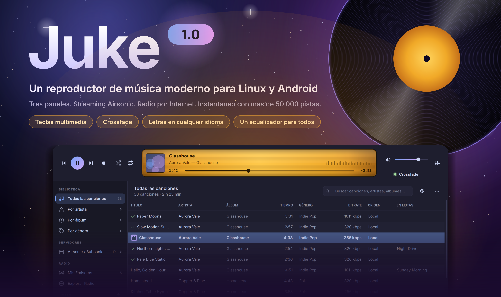
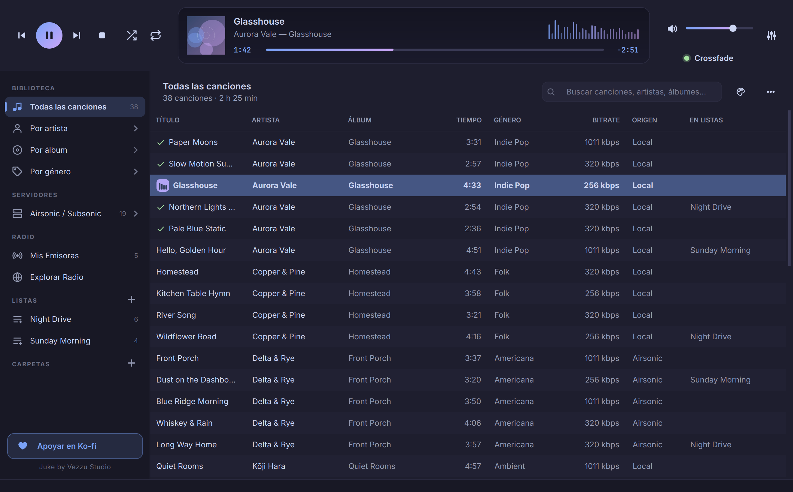

<div align="center">



<br>

**Un reproductor de música moderno para Linux y Android.**<br>
Tus archivos, tu servidor Airsonic / Subsonic, radio por Internet y un ecualizador de 10 bandas.

<br>

[English](README.md) · **Español**

<br>


[**Descargar**](https://github.com/vezzulab/juke/releases/latest) &nbsp;·&nbsp; [**Manual**](https://vezzulab.github.io/juke/manual.html) &nbsp;·&nbsp; [Sitio web](https://vezzulab.github.io/juke/) &nbsp;·&nbsp; [Informar de un problema](https://github.com/vezzulab/juke/issues)

</div>

<br>

<div align="center">

</div>

## Qué hace

Música local y Airsonic / Subsonic · radio por Internet · ecualizador de 10 bandas, también por canción · letras sincronizadas · listas y cola · tema oscuro, claro y veinte temas de color · español e inglés.

**Todo lo demás — cada función, cada atajo — está en el [manual](https://vezzulab.github.io/juke/manual.html)** (dentro de la app: `F1` en Linux, *Ajustes ▸ Manual* en Android).

## Instalación

**Linux** — descarga `Juke-x86_64.AppImage` de la [última versión](https://github.com/vezzulab/juke/releases/latest) y luego:

```sh
chmod +x Juke-x86_64.AppImage
./Juke-x86_64.AppImage
```

Necesita Linux x86_64 con glibc 2.35 o más nueva (Ubuntu 22.04, Debian 12, Fedora 36+) y FUSE 2. Todo lo demás va dentro del archivo.

**Android** — descarga `Juke-<versión>.apk` de la misma página (Android 8 o más nuevo).

Juke avisa cuando hay una versión nueva, o pulsa *Buscar actualizaciones…* en el menú o en *Ajustes ▸ General*.

## Privacidad

Sin telemetría, sin cuentas, sin analíticas. Solo se conecta a lo que usas: tu servidor, las emisoras, los servicios de letras y GitHub para buscar actualizaciones (se puede apagar). Los detalles están en el manual.

## Desarrollo

```sh
pip install -e .
python -m unittest discover -s tests -t .
packaging/build-appimage.sh
```

## Licencia

Gratis para usarlo con cualquier fin en tus propios dispositivos. No puede modificarse ni redistribuirse: comparte las [descargas oficiales](https://github.com/vezzulab/juke/releases). Términos completos en la [Licencia de Juke 1.0](LICENSE); el software de otros que incluye conserva su licencia ([NOTICE.md](NOTICE.md)).

## Créditos

[libVLC](https://www.videolan.org/), [Qt for Python](https://doc.qt.io/qtforpython-6/), [yt-dlp](https://github.com/yt-dlp/yt-dlp), [httpx](https://www.python-httpx.org/), [mutagen](https://mutagen.readthedocs.io/), [radio-browser.info](https://www.radio-browser.info/) y la tipografía [Inter](https://rsms.me/inter/) (licencia SIL Open Font).
