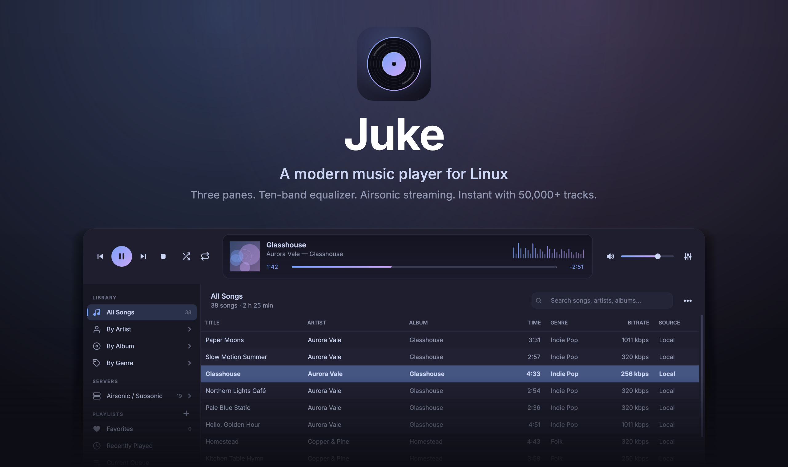
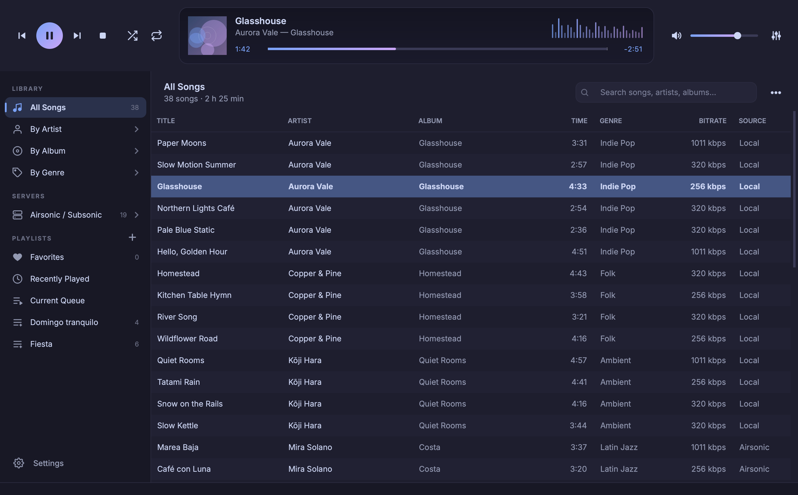

<div align="center">



<br>

**A modern 3-pane music player for Linux.**<br>
Your local library, your Airsonic / Subsonic server and a 10-band equalizer — and it stays instant with 50,000+ tracks.

<br>

**English** · [Español](README.es.md)

<br>


[**Download**](https://github.com/vezzulab/juke/releases/latest) &nbsp;·&nbsp; [**Website**](https://vezzulab.github.io/juke/) &nbsp;·&nbsp; [Report a problem](https://github.com/vezzulab/juke/issues)

</div>

<br>

## Why Juke

The classic iTunes 4 layout — sources on the left, songs in the middle, the player on top — rebuilt for today: a dark, rounded, Libadwaita-flavoured interface, a real audio pipeline, and a library that does not stutter when it grows.

<table>
<tr>
<td width="50%" valign="top">

### Instant, whatever the size
The song table never loads your library into memory. It keeps an ordered list of ids and pulls rows from SQLite one page at a time while you scroll. Search, sort and filter happen in the database, over indexed columns.

</td>
<td width="50%" valign="top">

### Airsonic, the way you keep it
Browse your server **by folders**, exactly as they are on disk, or by artist / album / genre. Songs stream directly over HTTP(S); nothing is downloaded first. Authentication uses Subsonic's salted token — your password is never sent.

</td>
</tr>
<tr>
<td valign="top">

### 10-band equalizer
Ten bands (60 Hz – 16 kHz), ±20 dB preamp, ten built-in presets and your own saved presets. It runs through libVLC's native equalizer on one long-lived player, so switching songs never resets it.

</td>
<td valign="top">

### A real queue, and your own playlists
**Play next** inserts right after the current song; **Add to queue** goes to the end. The queue is temporary and independent of the list you started from, which resumes when it is empty. Make playlists with the **+** next to *Playlists*.

</td>
</tr>
<tr>
<td valign="top">

### Local and remote, one library
Files on disk and songs on your server share the same metadata model. Juke only asks for the playable URL — `file:///…` or `https://…/stream.view` — at the moment you press Play.

</td>
<td valign="top">

### Bilingual, Wayland-ready
English and Spanish, switchable live. Qt 6 HiDPI scaling (fractional too), Wayland first with X11 fallback, and every icon is an SVG rendered at your screen's exact scale — nothing blurry.

</td>
</tr>
</table>

## Screenshots

<div align="center">

</div>

<table>
<tr>
<td width="50%"><br><sub><b>Airsonic by folders</b> — the server's hierarchy, expandable in the sidebar.</sub></td>
<td width="50%"><br><sub><b>Current queue</b> — Play next, Add to queue, then the list you started from.</sub></td>
</tr>
<tr>
<td><br><sub><b>Equalizer</b> — live response curve, presets, playback speed and stereo balance.</sub></td>
<td><br><sub><b>Settings</b> — language, music folders and your Airsonic / Subsonic server.</sub></td>
</tr>
</table>

## Install

### AppImage (recommended)

1. Download `Juke-x86_64.AppImage` from the [latest release](https://github.com/vezzulab/juke/releases/latest).
2. Make it executable and run it:

   ```sh
   chmod +x Juke-x86_64.AppImage
   ./Juke-x86_64.AppImage
   ```

3. On first launch Juke offers to add itself to your **applications menu with its icon**. It only touches your own user account (`~/.local/share/applications` and `~/.local/share/icons`) and you can undo it any time in *Settings*.

Everything Juke needs — Python, Qt and libVLC — is inside the file. You only need:

- x86_64 Linux with **glibc 2.35 or newer** (Ubuntu 22.04, Debian 12, Fedora 36 or newer)
- PulseAudio or PipeWire for sound (present on practically every desktop)
- FUSE 2 (`libfuse2`) — or run it with `--appimage-extract-and-run`

### From source

Juke needs libVLC installed on the system:

| Distribution | libVLC |
| --- | --- |
| Fedora | `sudo dnf install vlc-libs` (RPM Fusion) |
| Debian / Ubuntu | `sudo apt install libvlc5 vlc-plugin-base` |
| Arch | `sudo pacman -S vlc` |

```sh
git clone https://github.com/vezzulab/juke.git
cd juke
python -m venv .venv && . .venv/bin/activate
pip install -e .
juke                 # or: python -m juke
```

To add the launcher and icon of a source install to your menu: `juke --install-desktop` (and `--uninstall-desktop` to remove it). Files given on the command line are played: `juke song.flac`.

## Using it

| | |
| --- | --- |
| **Library** | Add your music folders in *Settings ▸ Library*. Juke indexes them in a background thread and only re-reads files that changed. |
| **Airsonic** | Click **Settings** at the bottom of the sidebar (or the *Set up Airsonic…* button on the empty Airsonic view) ▸ *Airsonic* tab: server address (e.g. `http://your-server:4040`), user and password, then *Test connection*. *Sync Airsonic* imports the server once; browse it under **Servers**. Finished songs are scrobbled to the server. |
| **Queue** | Right-click ▸ **Play next** / **Add to queue**. The *Current Queue* list shows what is playing, what you queued, and what follows. |
| **Playlists** | Click the **+** next to *Playlists* (or `Ctrl` + `N`) to create one. Right-click songs ▸ *Add to playlist*; right-click a playlist to rename or delete it. Playlists survive rescans and Airsonic re-syncs. |
| **Favorites** | Right-click ▸ *Mark as favorite*. |
| **Tags** | Right-click ▸ *Edit metadata…* writes to the file (local songs). |

| Shortcut | Action |
| --- | --- |
| `Space` | Play / pause |
| `Enter` or double-click | Play the selected song |
| `Ctrl` + `→` / `←` | Next / previous |
| `Ctrl` + `F` | Search |
| `Ctrl` + `N` | New playlist |
| `Ctrl` + `E` | Equalizer |
| `Ctrl` + `,` | Settings |
| `Ctrl` + `Q` | Quit |

## How it stays fast

- **SQLite with explicit indexes** on `artist`, `album`, `title`, `genre`, `source_type` (and `folder`), plus a composite index for the default order.
- **Scanning runs in a `QThread`** and reports through signals; the interface never waits on `mutagen`.
- **A virtual, lazy `QAbstractTableModel`**: ids in memory, rows fetched 256 at a time, at most 48 pages cached.
- **One audio pipeline**: a single libVLC media player for the whole session.

Measured on an AMD Ryzen 7 2700U laptop with 60,000 tracks (`tests/test_core.py`): default order in ~25 ms, a text search in ~100–140 ms, fetching one page of rows in ~2 ms.

## Project layout

```
juke/
├── main.py             entry point (Wayland/HiDPI setup, CLI)
├── config.py           XDG paths, settings persistence
├── i18n.py, locales/   English / Spanish, live switching
├── integration.py      applications-menu entry + icons (AppImage)
├── audio/              engine (libVLC), equalizer, queue, balance, source resolver
├── api/airsonic.py     async Subsonic REST client (httpx)
├── db/                 SQLite library and the background indexer
└── gui/                main window, top bar, sidebar, track table, equalizer, dialogs, QSS theme, SVG icons
packaging/              AppImage build (AppRun, desktop entry, scripts)
docs/                   the project website (GitHub Pages)
tests/                  unit and offscreen GUI tests
```

## Build the AppImage

```sh
packaging/build-appimage.sh     # writes dist/Juke-x86_64.AppImage
```

Build on the **oldest** distribution you want to support — an AppImage needs at least the glibc it was built with. The [release workflow](.github/workflows/appimage.yml) builds on Ubuntu 22.04. See the header of the script for the environment variables (`PYTHON_PREFIX`, `APPIMAGETOOL`, `RUNTIME_FROM`).

## Development

```sh
pip install -e .
python -m unittest discover -s tests -t .
QT_QPA_PLATFORM=offscreen QT_SCALE_FACTOR=2 python tools/make_assets.py assets   # regenerate screenshots
```

The tests include real playback through libVLC (skipped if libVLC is missing).

## Known limits

- The spectrum in the LCD is an **animated meter, not an analyser** — libVLC does not expose FFT data.
- Stereo **balance** needs PulseAudio or PipeWire (`pactl`) and a stereo stream; it is disabled otherwise.
- No MPRIS / global media keys yet, no gapless playback, no drag-and-drop reordering inside playlists, one Airsonic server at a time.
- Folder browsing is available for Airsonic; the local library is browsed by artist, album and genre.
