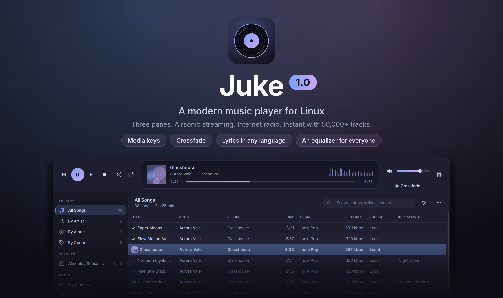
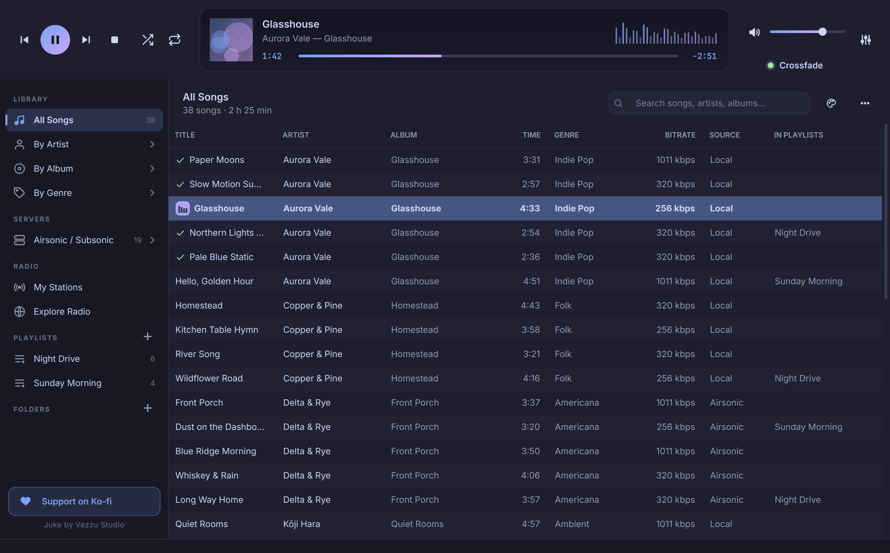

<div align="center">



<br>

**A modern music player for Linux and Android.**<br>
Your own files, your Airsonic / Subsonic server, internet radio and a 10-band equalizer.

<br>

**English** · [Español](README.es.md)

<br>


[**Download**](https://github.com/vezzulab/juke/releases/latest) &nbsp;·&nbsp; [**Manual**](https://vezzulab.github.io/juke/manual.html) &nbsp;·&nbsp; [Website](https://vezzulab.github.io/juke/) &nbsp;·&nbsp; [Report a problem](https://github.com/vezzulab/juke/issues)

</div>

<br>

<div align="center">

</div>

## What it does

Local music and Airsonic / Subsonic · internet radio · 10-band equalizer, also per song · synced lyrics · playlists and queue · dark, light and twenty colour themes · English and Spanish.

**Everything else — every feature, every shortcut — is in the [manual](https://vezzulab.github.io/juke/manual.html)** (inside the app: `F1` on Linux, *Settings ▸ Manual* on Android).

## Install

**Linux** — download `Juke-x86_64.AppImage` from the [latest release](https://github.com/vezzulab/juke/releases/latest), then:

```sh
chmod +x Juke-x86_64.AppImage
./Juke-x86_64.AppImage
```

Needs x86_64 Linux with glibc 2.35 or newer (Ubuntu 22.04, Debian 12, Fedora 36+) and FUSE 2. Everything else is inside the file.

**Android** — download `Juke-<version>.apk` from the same page (Android 8 or newer).

Juke tells you when a new version is out, or press *Check for updates…* in the menu or in *Settings ▸ General*.

## Privacy

No telemetry, no accounts, no analytics. It only connects to what you use: your server, radio stations, lyrics services and GitHub to look for updates (switchable). Details are in the manual.

## Development

```sh
pip install -e .
python -m unittest discover -s tests -t .
packaging/build-appimage.sh
```

## License

Free to use for any purpose on your own devices. It may not be modified or redistributed: share the [official downloads](https://github.com/vezzulab/juke/releases) instead. Full terms in the [Juke License 1.0](LICENSE); included third-party software keeps its own licence ([NOTICE.md](NOTICE.md)).

## Credits

[libVLC](https://www.videolan.org/), [Qt for Python](https://doc.qt.io/qtforpython-6/), [yt-dlp](https://github.com/yt-dlp/yt-dlp), [httpx](https://www.python-httpx.org/), [mutagen](https://mutagen.readthedocs.io/), [radio-browser.info](https://www.radio-browser.info/) and the [Inter](https://rsms.me/inter/) typeface (SIL Open Font License).
