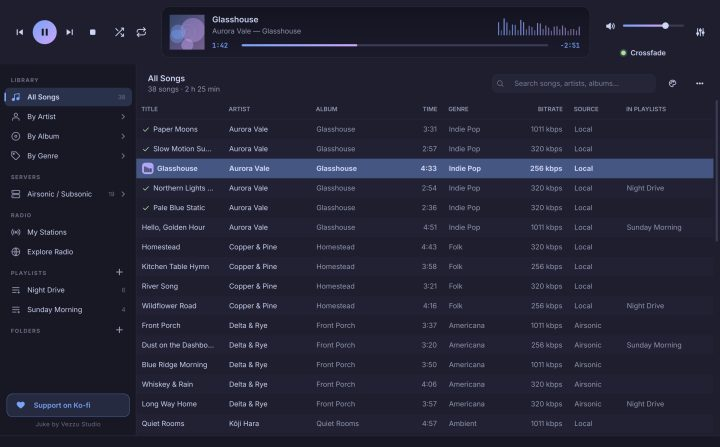
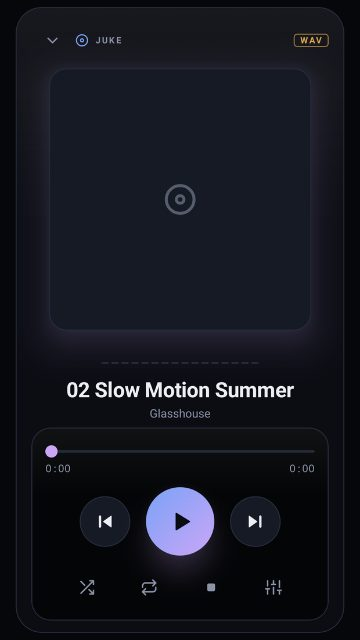
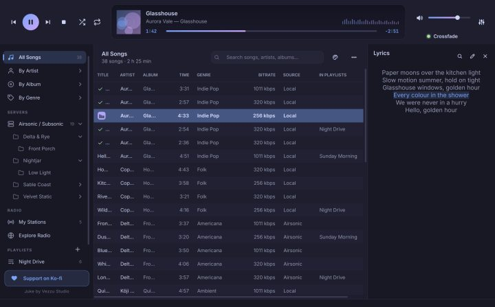
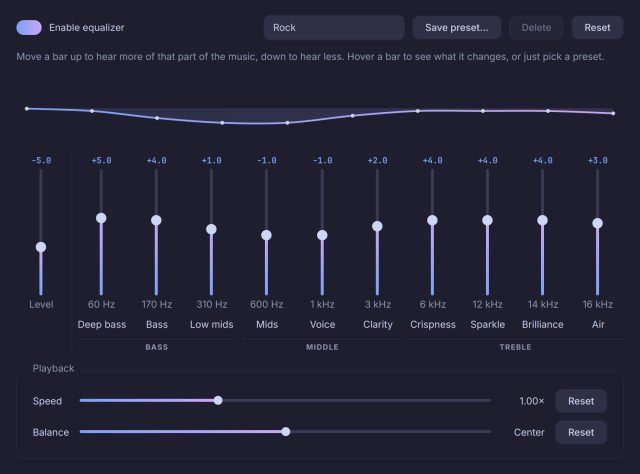
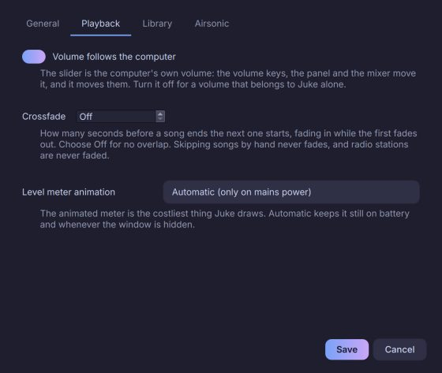

# 1. Welcome to Juke 1.0

Juke is a music player for your own music: the files on your computer or phone, the songs on your Airsonic / Subsonic server, and internet radio, all in one place that stays fast and light on the battery.

This manual is a book. The index on the side lists every chapter and section; you can read it from the first page or jump to what you need. It is also inside the app (press `F1` on Linux, or *Settings ▸ Manual* on Android), so it is always with you and in your language.

## What is new in 1.0

- **Media keys and the desktop's controls.** Play, pause, next and back work from your keyboard, headset and the media widget of your desktop. The volume slider is the computer's own volume, both ways.
- **Crossfade.** The next song comes in a few seconds before the current one ends. A light under the volume shows whether it is on.
- **An equalizer anyone can use.** Every bar says what it changes, and there are 35 presets.
- **Lyrics in any language.** Several free services are searched at once.
- **Better playlists.** A song is never added twice, you are told when it is already there, and the same menu takes it out.
- **It knows what can play.** Songs on an offline server or a disconnected drive turn grey with a note.
- **Marks on the list.** Bars dance beside the song that is playing and a green ✓ marks what already played.
- **A manual inside the app**, with an index, in English and Spanish.

## How this manual is written

Words in *italics* are names you see on screen: menus, buttons, tabs. Keys are written like `Ctrl` + `E`. Parts that only apply to one system say so in the title: **Linux** for the computer app, **Android** for the phone and tablet app. Everything else is the same on both.

---

# 2. Installing and updating

<!--linux-->
## Installing on Linux

Juke is one file, an AppImage, with everything inside (Python, Qt, libVLC). There is nothing else to install.

1. Download `Juke-x86_64.AppImage` from the latest release on GitHub (about 190 MB).
2. Allow it to run: right-click the file ▸ *Properties* ▸ *Allow executing*, or in a terminal `chmod +x Juke-x86_64.AppImage`.
3. Open it. The first time it runs, Juke adds itself to your applications menu, with its icon. It only touches your own user account, and you can undo it in *Settings ▸ General*.

In one line: `curl -fsSL https://vezzulab.github.io/juke/install.sh | sh`.

What it needs: x86_64 Linux with glibc 2.35 or newer (Ubuntu 22.04, Debian 12, Fedora 36 or newer), PulseAudio or PipeWire for sound, and FUSE 2 (`libfuse2`) or the option `--appimage-extract-and-run`.

## Installing from the source code

Juke needs libVLC on the system. Then `pip install -e .` inside the folder and run `juke`. To add the launcher and icon to your menu: `juke --install-desktop` (and `--uninstall-desktop` to remove them). Files given on the command line are played: `juke song.flac`.
<!--/linux-->

<!--android-->
## Installing on Android

1. Download `Juke-<version>.apk` from the latest release on GitHub (about 3 MB).
2. Open the file. Android asks you to allow *Install unknown apps* for your browser or file manager, once.
3. Juke needs Android 8 or newer, on a phone or a tablet.

The first time it opens, Juke asks permission to read your music. Say yes, or the library will be empty.
<!--/android-->

## Updating

Juke looks for new versions when it opens and every 30 minutes while it is open. If there is one, it shows which version you have, which one is out and what changed, and **you** choose: *Update now*, *Later* or *Skip this version*. The download is checked against its SHA-256 before anything is replaced. You can turn the check off in *Settings*, and check by hand from the ⋯ menu ▸ *Check for updates…*.

<!--linux-->
If the AppImage is in a folder you can write to, *Update now* replaces it in place and offers to restart. Otherwise Juke tells you where to download the new file.
<!--/linux-->

<!--android-->
On Android, Juke downloads the new APK, checks it and hands it to Android's installer. The first time you allow *Install unknown apps* for Juke.
<!--/android-->

If you have Juke 0.3 or any earlier version, it will offer 1.0 by itself the same way. Your library, playlists and settings are kept.

---

# 3. A tour of the window

<!--linux-->

Juke has three panes:

- **Top: the player.** Previous, play / pause, next and stop; shuffle and repeat; the display with the cover, the title, the time bar and the level meter; the volume with the *Crossfade* light under it; and the equalizer button.
- **Left: the sidebar.** Your sources: *Library* (all songs, by artist, album and genre), *Servers*, *Radio*, *Playlists* and *Folders*. When a phone or tablet is plugged in, a *Devices* section appears.
- **Centre: the songs.** A table with the title, artist, album, time, genre, bitrate, source and the playlists each song is in. Click a column to sort; click again to reverse; a third time to go back to the natural order.

Above the table there is the search box (`Ctrl` + `F`), the palette button for colour themes, and the ⋯ menu with everything else: *Show* (Favorites, Recently played, Current Queue), *Find duplicates*, *Settings*, *Check for updates*, *Send feedback*, *View log* and this manual.
<!--/linux-->

<!--android-->

Juke on Android has four tabs along the bottom (a side rail on a tablet): **Library** (your music, by folders), **Server** (your Airsonic / Subsonic server), **Radio** and **Settings**. Tap the player bar to open the big player, with the cover, the time bar and the controls.
<!--/android-->

## The song that is playing

<!--linux-->
The song that is playing has a small badge with moving bars beside its title. A green ✓ marks the songs that already played since you opened Juke. Songs that cannot be played right now are grey (see *Songs that are not available*).
<!--/linux-->
<!--android-->
The song that is playing is highlighted in the list. Songs that cannot be played right now are grey.
<!--/android-->

---

# 4. Your music

## The library

<!--linux-->
Add your music folders in *Settings ▸ Library* (or with the button on the empty library). Juke reads them in the background, at low priority, and only re-reads the files that changed. It stays fast with tens of thousands of songs: searching, sorting and filtering never wait for the whole library.

Every time you come back to the window, Juke quietly checks for songs that were added, moved or deleted. You can turn *Look for changes when Juke opens* off in *Settings ▸ Library*.

Browse your music under *Library*: **All Songs**, **By Artist**, **By Album** and **By Genre**. Type in the search box to filter by title, artist, album or genre.
<!--/linux-->

<!--android-->
Juke lists the music on your card or in the phone's storage, **by folders**, as you keep it. Phones without a card show the internal storage. Tap a folder to open it; the back button goes up one level. Use the sort button to order folders and songs from A to Z or from Z to A.
<!--/android-->

## Favorites and recent songs

<!--linux-->
Right-click a song ▸ *Mark as favorite*. Show your favorites, the songs you played recently and the current queue from the ⋯ menu ▸ *Show*.
<!--/linux-->
<!--android-->
Mark a song as a favorite from its menu. Your favorites are in the library.
<!--/android-->

<!--linux-->
## Edit tags and covers

Right-click one song, or select several (`Ctrl` + `A`, `Ctrl` + click, `Shift` + click) ▸ *Edit metadata…*. Only the fields you change are written to the files. You can add, replace or remove the cover, or just drop an image on the window; it is stored inside the file. This works for songs on your computer; songs on a server cannot be edited.

## Find duplicates

⋯ menu ▸ *Find duplicates* shows songs that are the same, either the same title, artist and album, or exactly the same file.
<!--/linux-->

---

<!--linux-->
# 5. Folders of your own

Under **Folders** in the sidebar, Juke keeps your music the way you arrange it. There is no import step: whatever you do, it just happens.

- Click the **+** next to *Folders* (or `Ctrl` + `Shift` + `N`) to make a folder. Put folders inside folders.
- Drag songs into a folder from the list, or drop files and whole folders from your file manager onto the sidebar. Dropped folders keep their layout.
- Right-click a folder to rename, duplicate or delete it, to sort what is inside (A→Z, Z→A, by number, newest, oldest), or to play it, shuffle it or add it to the queue.
- Deleting a folder takes its songs out of Juke. **The files stay on your disk.** Juke never moves, renames or deletes your music files.

## Music.juke

Juke creates a folder called **Music.juke** inside your Music folder. Open it and you find `folders.db` (how things are organized), a `Folders` directory with the same tree as shortcuts to your songs, and a short README. That way your arrangement is visible from any other program too.

If you delete or move a folder in your file manager, Juke notices as soon as you come back.
<!--/linux-->

---

# 6. Playing music

## The controls

| Control | What it does |
| --- | --- |
| ⏮ Previous | Goes back to the song before. If more than 3 seconds have played, it restarts the song first. After you pick a song from the middle of a list, it goes up the list. |
| ⏯ Play / pause | Plays or pauses. |
| ⏭ Next | Goes to the next song. |
| ⏹ Stop | Stops. Nothing is playing and the marks beside the song disappear. |
| 🔀 Shuffle | Plays the list in a random order: every song once, none twice in a row. Turn it off and the list continues in its own order from the current song. |
| 🔁 Repeat | Off, repeat the whole list, or repeat one song. |

Click or drag the time bar to jump to another point. Double-click a song, or select it and press `Enter`, to play it from the list.

## The queue

Right-click a song ▸ **Play next** puts it right after the current song. **Add to queue** puts it at the end. The queue is temporary and independent: when it is empty, the list you started from continues. See it all under *Current Queue* (<!--linux-->⋯ menu ▸ *Show*<!--/linux--><!--android-->in the player<!--/android-->): what is playing, what you queued, and what follows.

<!--linux-->
If you take a song out of the playlist or folder that is playing, it also leaves the queue; a song you put in waits at the end.
<!--/linux-->

## Crossfade

Crossfade brings the next song in while the current one fades out, so there is no silence between them.

<!--linux-->
Under the volume there is a light with the word **Crossfade**: green when it is on, grey when it is off. Click it to turn it on or off; it comes back with the seconds it had last (5 the first time). To choose how many seconds (1 to 12), open *Settings ▸ Playback*.
<!--/linux-->
<!--android-->
Turn it on and choose the seconds in *Settings*.
<!--/android-->

Crossfade only happens when a song ends by itself. If you skip a song by hand it changes at once, and radio stations are never faded. Songs shorter than a few seconds more than the crossfade are not overlapped.

## Volume

<!--linux-->
The volume slider **is the computer's own volume**: the volume keys of your keyboard, the panel's volume and the mixer move it, and moving it moves them. The speaker button mutes. If you prefer a volume that belongs to Juke alone, turn off *Volume follows the computer* in *Settings ▸ Playback*.
<!--/linux-->
<!--android-->
Use the volume keys of the phone. Juke follows the system volume.
<!--/android-->

<!--linux-->
## Keeping the computer awake

While a song or a station is playing, Juke asks the desktop not to put the computer to sleep and not to turn the screen off, so a laptop does not fall asleep in the middle of a party. It lets go as soon as you pause or stop, and the computer sleeps as usual again. You can turn it off with *Keep the computer awake while music plays* in *Settings ▸ Playback*. Closing the lid still follows your power settings: if the laptop must keep playing with the lid closed, set that in your desktop's power options.
<!--/linux-->

<!--linux-->
## Keyboard and media keys

Play, pause, stop, next and previous work from the media keys of your keyboard or headset, from the media widget of your desktop (GNOME, KDE and the rest), and from tools such as `playerctl`. The Play key also pauses when a song is playing. The shortcuts are in the chapter *Keyboard shortcuts*.
<!--/linux-->

<!--android-->
## The lock screen and headphones

Juke keeps playing with the screen off. The player card on the lock screen, the notification, and the buttons of headsets and Bluetooth devices work; tapping the notification opens Juke, and the system can resume what was playing.
<!--/android-->

## Speed and balance

<!--linux-->
In the equalizer window (see *The equalizer*), under *Playback*: **Speed** from 0.5× to 2× and **Balance** between left and right. Balance needs PulseAudio or PipeWire and a stereo stream; it is disabled otherwise.
<!--/linux-->
<!--android-->
The equalizer is in the player or in *Settings*.
<!--/android-->

---

# 7. Playlists

## Make a playlist

<!--linux-->
Click the **+** next to *Playlists* (or `Ctrl` + `N`), type a name and press *Save*. Or right-click songs ▸ *Add to playlist* ▸ *New playlist…* to make one already holding those songs. Right-click a playlist to rename or delete it. Playlists survive rescans and server syncs.
<!--/linux-->
<!--android-->
Open a song's menu ▸ *Add to playlist* ▸ *New playlist…*, or add it to one you already have.
<!--/android-->

## Add and remove songs

<!--linux-->
Right-click one or more songs ▸ **Add to playlist**. In that menu every playlist shows what it holds:

- **✓ Name**: all the selected songs are already in it. **Choose it again to take them out.**
- **◐ Name**: some of the songs are in it. Choose it to add the ones that are missing.
- **Name** with no mark: none are in it. Choose it to add them.

A song that is already in a playlist is **never added twice**; Juke tells you "That song is already in…". You can also drag songs from the list onto a playlist in the sidebar.

Inside a playlist, right-click ▸ *Remove from playlist* takes the selected songs out. Playlists made before 1.0 may hold a song twice; you can remove each copy on its own.

Every song in the library also shows, in the **In playlists** column, the names of the playlists that hold it.
<!--/linux-->
<!--android-->
In the menu of a song, the playlists that already hold it are marked; choose one again to take the song out. A song is never added twice to the same playlist.
<!--/android-->

---

# 8. Servers: Airsonic and Subsonic

Juke can play the music on your own server: Airsonic, Airsonic-Advanced, Subsonic, Navidrome and anything that speaks the same protocol. Songs are streamed directly; nothing is downloaded first.

## Connect to your server

Open <!--linux-->*Settings ▸ Airsonic*<!--/linux--><!--android-->*Settings* ▸ the server section<!--/android--> and fill in the server address (for example `http://your-server:4040`), your user and your password. Press *Test connection*. Then *Sync Airsonic* imports the server's library. Use `https://` when you can.

Browse the server under **Servers** **by folders**, exactly as it shows them, or by artist, album and genre. A library of 6,000 songs syncs in about 8 seconds. Songs you finish are reported back to the server (scrobbled).

## Songs that are not available

A song on a server needs the internet (or your network) and the server answering. A local song needs its file, which may live on a NAS or a drive that is not plugged in.

When a song cannot be played right now:

- It turns **grey**, and the *Source* column says **Go online** (the server does not answer) or **Not connected** (the drive or network folder is not there).
- Hover it to see why.
- If you try to play it, Juke tells you why and, for a server, asks again in case it is back.
- A list or queue passes over such songs instead of stopping.

Juke checks when it opens, when you come back to the window, when the computer goes on or off the network, and when a song of the server fails. When the connection returns, the grey goes away by itself and Juke tells you once.

---

# 9. Internet radio

Under **Radio**: *My Stations* (yours) and *Explore Radio* (the community directory).

- **Explore Radio:** search by name or pick a tag. ♥ saves a station; ▶ tunes in.
- **Add station by URL…:** paste any address. Juke shows *Searching for an audio signal…* while it works it out. It accepts a stream (`.mp3`, `.aac`, `.ogg`, `.m3u8`), an Icecast or Shoutcast address, a `.pls` or `.m3u` playlist, or a web page that contains a player. A page with several stations offers them all. Name and icon come from the station.
- **On the air:** the display shows **LIVE**, the station and the song that is playing, when the station sends it.
- **Stations move.** Stations change their address all the time. A saved station remembers where it came from and, when it moves, Juke follows it and remembers the new address.

Stations that need a login or use protected streams are not supported.

---

# 10. Lyrics

## See the lyrics

A panel on the right opens by itself when the song that is playing has lyrics, and stays shut when it has none. **Synced** lyrics light up the line being sung. Juke reads the lyrics you saved, a `.lrc` file next to the song, and the lyrics inside the file's tags.

<!--linux-->

<!--/linux-->

## Find lyrics

Right-click a song ▸ **Find lyrics…**. Juke searches several free services at once: LRCLIB, NetEase Cloud Music and lyrics.ovh. Together they cover English, Spanish, Portuguese, Chinese, Japanese, Korean, Arabic, Hindi and many more languages.

- The title is cleaned of "(feat. …)", "[Remastered]" and similar, in any script, and "Artist - Song" is understood.
- Results are sorted with the best match first, synced ones before plain ones. The same song by another artist (a cover) can show up; check the artist before using it.
- If a service is busy, Juke asks again and tells you which did not answer.
- What you found is kept for a few days, so repeating a search is instant and works without internet.

In the results, choose one and press *Use*. Only the song's name, artist, album and length are sent.

## Add your own

Right-click a song ▸ **Add lyrics…**: paste them, or import a `.lrc` file (lines like `[01:23.45] words`, which makes them follow the song). Old files in other encodings (GBK, Shift-JIS, EUC-KR…) are read correctly, and right-to-left languages are shown the right way.

## Automatic search

In *Settings ▸ Library*, *Search lyrics online* looks for songs that have no lyrics, by itself, as they start to play. It is off by default.

<!--android-->
## Karaoke

On Android the lyrics screen has a **Karaoke** mode: big lines, and a countdown into each phrase.
<!--/android-->

---

# 11. The equalizer

<!--linux-->
Open it with `Ctrl` + `E` or the button on the right of the player.

<!--/linux-->
<!--android-->
Open the equalizer from the player.
<!--/android-->

You do not need to be a sound engineer. Move a bar **up** to hear **more** of that part of the music, **down** to hear **less**. Or just pick a preset.

## What each bar changes

| Bar | Name | What it is |
| --- | --- | --- |
| 60 Hz | **Deep bass** | The rumble you feel in your chest: kick drums, sub-bass, 808s. Too much makes it boomy. |
| 170 Hz | **Bass** | Punch and warmth: the bass guitar and the body of the kick. |
| 310 Hz | **Low mids** | The fullness of voices and guitars. Too much sounds muddy, too little thin. |
| 600 Hz | **Mids** | The core of most instruments. Too much sounds boxy. |
| 1 kHz | **Voice** | Where singers and snare drums sit. Raise it to hear the words better. |
| 3 kHz | **Clarity** | Detail and bite. Too much is harsh and tiring. |
| 6 kHz | **Crispness** | The "s" sounds and the hi-hats. Too much hisses. |
| 12 kHz | **Sparkle** | Cymbals and shimmer. Raise it for a brighter sound. |
| 14 kHz | **Brilliance** | The sheen on top of the music. |
| 16 kHz | **Air** | The open feeling at the very top. |

The bars are grouped as **Bass**, **Middle** and **Treble**. The curve above the bars shows the sound you are shaping.

## Level (preamp)

The first bar, *Level*, is the overall level of the equalizer. If the sound distorts after you raise a band, lower it. Presets set it for you, so a boost never makes the sound break up.

## Presets

Thirty-five ready-made curves: *Flat*, *Rock*, *Pop*, *Jazz*, *Classical*, *Electronic*, *Heavy Metal*, *Techno*, *Hip-Hop*, *R&B*, *Dance*, *Acoustic*, *Blues*, *Country*, *Reggae*, *Latin*, *Dembow*, *Reggaeton*, *Salsa*, *Merengue*, *Bachata*, *Cumbia*, *Afrobeat*, *K-Pop*, *Vocal*, *Speech / Podcast*, *Live*, and fixes for the place or the way you listen: *Bass Boost*, *Bass Reducer*, *Treble Boost*, *Treble Reducer*, *Loudness*, *Small Speakers*, *Headphones* and *Night (quiet)*.

Move a bar and the preset becomes *Custom*. **Save preset…** keeps your own curve under a name; *Delete* removes it. *Reset* goes back to *Flat*. The equalizer stays on when the song changes.

---

# 12. Looks and language

<!--linux-->
- **Dark, light or like your desktop:** *Settings ▸ General ▸ Theme*, or `Ctrl` + `T` to switch.
- **Twenty colour themes** (ten light, ten dark) from the palette button next to the ⋯ menu. All are checked for legibility.
- **Language:** English or Spanish, in *Settings ▸ General*. It changes right away, including this manual.
- The level meter in the display is decorative (a moving meter, not an analyser). *Settings ▸ Playback* lets it move automatically only on mains power, always, or never.
<!--/linux-->
<!--android-->
- **Colors:** *Settings ▸ Colors* has the same twenty themes, dark and light.
- **Language:** English or Spanish, in *Settings*.
<!--/android-->

---

<!--linux-->
# 13. Phones and tablets

Plug an Android phone or tablet in with a USB cable and, on the device, choose *File transfer*. It appears under **Devices** in the sidebar.

- Drag songs, or whole folders, onto the device to copy them.
- Right-click songs ▸ *Send to* the device.
- You can see what is on the device, remove songs from it, and cancel a transfer in progress.
- When you finish, use the eject button beside the device before you unplug it.

Juke only copies music files and never changes your library.
<!--/linux-->

---

# 14. Settings

<!--linux-->
Open them with `Ctrl` + `,` or from the ⋯ menu. There are four tabs:

| Tab | What is in it |
| --- | --- |
| **General** | Language, theme, *Check for updates automatically*, *Show Juke in the applications menu*. |
| **Playback** | *Keep the computer awake while music plays*, *Volume follows the computer*, *Crossfade* (seconds, or off) and the level meter. |
| **Library** | Your music folders, *Look for changes when Juke opens* and *Search lyrics online*. |
| **Airsonic** | The server address, user and password, and *Test connection*. |
<!--/linux-->
<!--android-->
*Settings* has the language, the colors, lyrics and update options, *Rescan*, the equalizer, and a **Help** section with *Send feedback*, the app's log (private details hidden) and *Support on Ko-fi*.
<!--/android-->

---

# 15. Updates, feedback and privacy

## Feedback

**Send feedback…** and **View log…** are in the ⋯ menu (*Settings ▸ Help* on Android). A report opens as a new issue on GitHub for you to review before sending. Your home folder, passwords and server address are hidden first. Juke sends nothing by itself.

## Privacy

Juke has no accounts, no telemetry and no analytics. It connects only to:

| What | When |
| --- | --- |
| Your Airsonic / Subsonic server | Only if you set one up. |
| `api.github.com` | When it opens and every 30 minutes, to look for a new version, if you leave the check on. Only the program name and version are sent. |
| Radio Browser and the stations | Only when you open *Explore Radio*, add a station or tune in. |
| `lrclib.net`, `music.163.com`, `api.lyrics.ovh` | Only when you press *Find lyrics…*, or if you turned on *Search lyrics online*. They get the song's name, artist, album and length. |

Your music, playlists and settings are always yours and stay on your device.

## Where things are stored

<!--linux-->
Your library is a database in `~/.local/share/juke`, the settings in `~/.config/juke` and the covers in `~/.cache/juke`. The log is `juke.log`. Your folders are described in `Music.juke`, inside your Music folder.
<!--/linux-->
<!--android-->
Everything stays inside the app's own storage on the phone. Uninstalling Juke removes it.
<!--/android-->

---

<!--linux-->
# 16. Keyboard shortcuts

| Shortcut | Action |
| --- | --- |
| `Space` | Play / pause |
| `Enter` or double-click | Play the selected song |
| `Ctrl` + `→` / `←` | Next / previous |
| Media keys | Play, pause, stop, next, previous |
| `Ctrl` + `F` | Search |
| `Ctrl` + `N` | New playlist |
| `Ctrl` + `Shift` + `N` | New folder |
| `Ctrl` + `E` | Equalizer |
| `Ctrl` + `L` | Show / hide lyrics |
| `Ctrl` + `T` | Switch light / dark |
| `Ctrl` + `,` | Settings |
| `F1` | This manual |
| `Ctrl` + `Q` | Quit |
<!--/linux-->

---

# 17. When something goes wrong

**There is no sound.** Check that PulseAudio or PipeWire is running and that the volume is not muted. If you turned off *Volume follows the computer*, check Juke's own volume too.

**My music does not show.** <!--linux-->Add the folder in *Settings ▸ Library*; Juke indexes in the background and the status bar shows the progress.<!--/linux--><!--android-->Check that you gave Juke permission to read your music.<!--/android-->

**The media keys do nothing.** <!--linux-->Close any other player that was opened earlier; the keys go to the last one that announced itself. Juke announces itself to the desktop when it opens.<!--/linux--><!--android-->Make sure no other player took over the headset buttons.<!--/android-->

**Songs are grey.** The server does not answer or the drive is not connected. Go online or connect the drive; Juke notices by itself.

**Find lyrics says nothing was found.** The song may not be in the free services under that spelling. Try "Artist - Song" in the title, or add the lyrics yourself (see *Lyrics*).

**A radio station stopped.** Stations move; Juke follows them when it can. Try *Explore Radio* for the same station.

**Still stuck?** Use *Send feedback…*: the report includes the log with your private details hidden.

---

# 18. About Juke

Juke is made by Vezzu Studio. It is free to use, for any purpose, on as many computers and devices as you own. The source is published so it can be read and checked; the full terms are in the Juke License 1.0. The software of others that Juke includes keeps its own licence, listed in `NOTICE.md`.

If Juke is useful to you, you can support it on Ko-fi from the button in the sidebar<!--android--> or in *Settings*<!--/android-->.

Thank you for listening.
